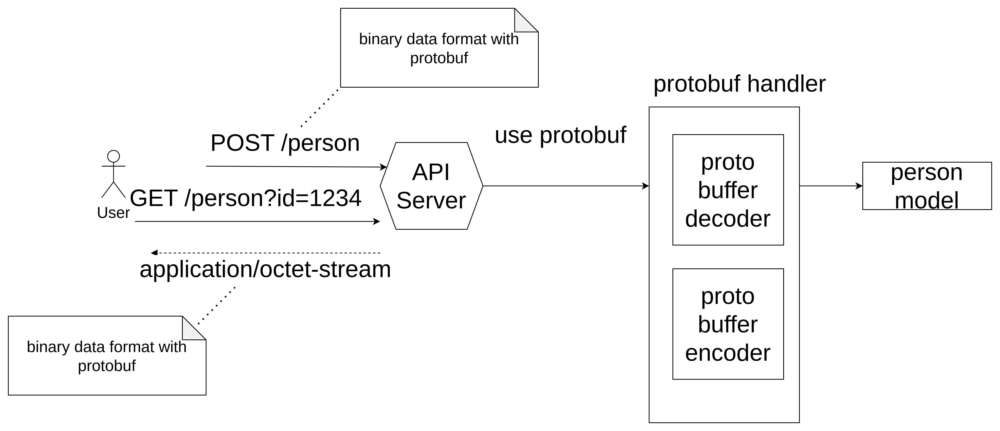

# golang-protobuf-sample

This repository is for demo how to use golang protobuf

## install dependency for build .proto to client code

```shell=
go get google.golang.org/protobuf@latest
go install google.golang.org/protobuf/cmd/protoc-gen-go@latest
```

## handle data with protobuf



## write protobuf model
```proto
syntax = "proto3";

option go_package = "github.com/leetcode-golang-classroom/golang-protobuf-sample/protos";

enum PhoneType {
  MOBILE = 0;
  HOME = 1;
  WORK = 2;
}

message PhoneNumber {
  string number = 1;
  PhoneType type = 2;
}

message Person {
  string name = 1;
  int32 id = 2;
  string email = 3;
  repeated PhoneNumber phones = 4;
}
```
## gen from proto to go code
```shell
protoc --go_out=. --go_opt=paths=source_relative protos/person.proto
```

## handler logic

```golang
func addPersonHandler(w http.ResponseWriter, r *http.Request) {
	if r.Method != http.MethodPost {
		http.Error(w, "Only POST method is allowed", http.StatusMethodNotAllowed)
		return
	}

	body, err := io.ReadAll(r.Body)
	if err != nil {
		http.Error(w, "Failed to read request body", http.StatusBadRequest)
		return
	}
	defer r.Body.Close()

	person := protos.Person{}
	err = proto.Unmarshal(body, &person)
	if err != nil {
		http.Error(w, "Failed to unmarshal Protobuf", http.StatusBadRequest)
		return
	}
	persons[person.Id] = &person
	fmt.Fprintf(w, "Person added: %v\n", &person)
}

func getPersonHandler(w http.ResponseWriter, r *http.Request) {
	if r.Method != http.MethodGet {
		http.Error(w, "Only GET method is allowed", http.StatusMethodNotAllowed)
		return
	}

	idStr := r.URL.Query().Get("id")
	if idStr == "" {
		http.Error(w, "Missing id parameter", http.StatusBadRequest)
		return
	}
	idInt, err := strconv.Atoi(idStr)
	if err != nil {
		fmt.Println("Errro converting string to int:", err)
		return
	}
	id := int32(idInt)
	person := persons[id]
	if person == nil {
		http.Error(w, "Person not found", http.StatusNotFound)
		return
	}
	data, err := proto.Marshal(person)
	if err != nil {
		http.Error(w, "Failed to marshal Protobuf", http.StatusInternalServerError)
		return
	}

	w.Header().Set("Content-Type", "application/octet-stream")
	w.Write(data)
}
```